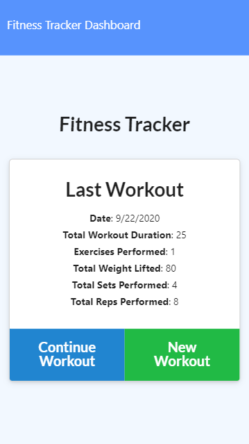

# **Workout-Tracker**

## Description

``
As a user, I want to be able to view create and track daily workouts. I want to be able to log multiple exercises in a workout on a given day. I should also be able to track the name, type, weight, sets, reps, and duration of exercise. If the exercise is a cardio exercise, I should be able to track my distance traveled.
``

## Table of- Contents
- [Questions](#Questions)
- [Description](#Description)
- [License](#License)
- [Live App Link](#Live-App-Link)
- [Mobile Screen Capture](#Mobile-Screen-Capture)
- [Screen Capture](#Screen-Capture)
- [Repository Link](#Repository)
- [Contributors](#Contributors) 

## Live App Link

- [Heroku App Link](https://workout-tracker-48023.herokuapp.com/)

# Mobile screen capture

# Screen Capture

# Screen Dashboard Capture

## License

## Contributors
``
Bobby Jones Jr.
``
## Repository

- [Project Repo](https://github.com/jones9682/Workout-Tracker)

## Questions

If you have any questions about the repo, open an issue or contact me directly at jones9682@yahoo.com. You can find more of my work at my [GitHub Profile](https://github.com/jones9682).
